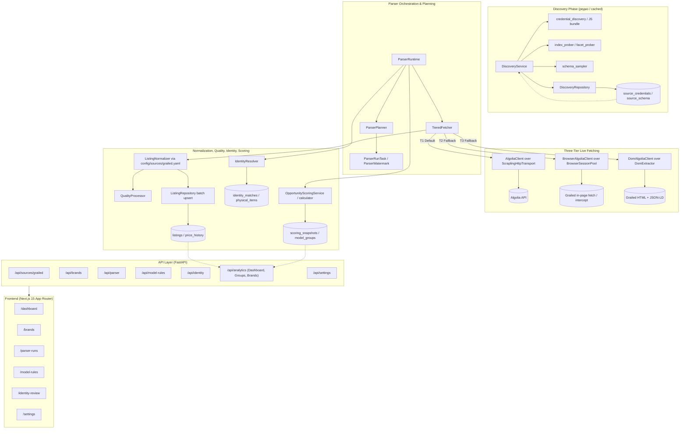
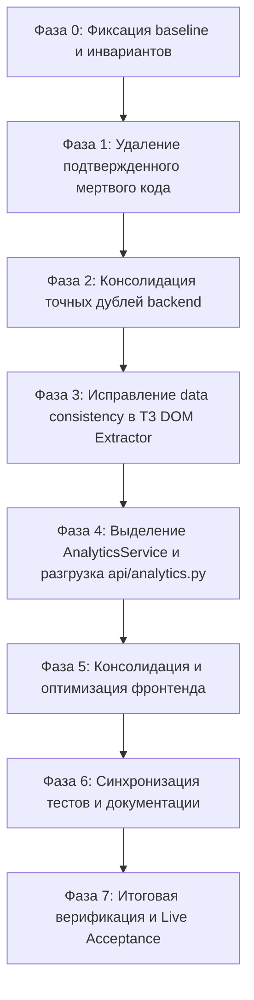

# План комплексного безопасного рефакторинга Grailed Liquidity Analyzer

> [!IMPORTANT]
> Данный документ представляет собой **только аналитический отчет и поэтапный план рефакторинга**. Код проекта, конфигурации, тесты и файлы базы данных на данном этапе **не модифицировались и не удалялись**.

---

## A. Краткое резюме

### 1. Текущее состояние архитектуры
Проект **Grailed Liquidity Analyzer** находится в работоспособном состоянии и успешно прошел основные фазы разработки (Фазы 0–5 в [TASKS.md](file:///c:/Users/Alex/Documents/IDE/parser/TASKS.md)):
- Реализована строгая **live-first архитектура** без mock/replay/fake-режимов.
- Четко выстроена трехуровневая стратегия сбора данных:
  - **T1** (Direct Algolia через `ScraplingHttpTransport` / `curl_cffi`);
  - **T2** (Browser-mediated Algolia через `BrowserSessionPool` / `AsyncStealthySession`);
  - **T3** (DOM fallback через `DomAlgoliaClient` / `DomExtractor` со Scrapling adaptive selectors).
- Обеспечены ключевые инварианты: использование `Decimal` для денег, идемпотентный upsert по `grailed_id`, сохранение `raw_json` и `schema_version`, возобновляемость через `parser_run_tasks`, защита от ложного перехода active $\to$ sold через `removed_pending`, маскирование секретов и хеширование seller usernames.

### 2. Главные источники сложности и технического долга
1. **Мертвый и неиспользуемый код в транспортном слое**:
   - Класс `HostRotator` в [backend/app/services/transport/hosts.py](file:///c:/Users/Alex/Documents/IDE/parser/backend/app/services/transport/hosts.py#L8-L22) нигде в runtime не используется (вместо него работает `AlgoliaHostPool`).
   - Функция `with_retry` в [backend/app/services/transport/resilience.py](file:///c:/Users/Alex/Documents/IDE/parser/backend/app/services/transport/resilience.py#L32-L59) не используется клиентами (у `AlgoliaClient` собственный retry-цикл).
   - Оба символа вызываются исключительно в [backend/tests/test_transport_resilience.py](file:///c:/Users/Alex/Documents/IDE/parser/backend/tests/test_transport_resilience.py).
2. **Точные дубли вспомогательных функций и DTO**:
   - Конвертация `_cents`: [backend/app/api/identity.py:236-237](file:///c:/Users/Alex/Documents/IDE/parser/backend/app/api/identity.py#L236-L237) и [backend/app/api/analytics.py:465-466](file:///c:/Users/Alex/Documents/IDE/parser/backend/app/api/analytics.py#L465-L466).
   - Локальные dataclass-определения учетных данных Algolia (`_Credentials` / `_CanaryCredentials`): дублируются в [backend/app/cli.py:34-39](file:///c:/Users/Alex/Documents/IDE/parser/backend/app/cli.py#L34-L39), [backend/app/services/parser/runtime.py:44-49](file:///c:/Users/Alex/Documents/IDE/parser/backend/app/services/parser/runtime.py#L44-L49), [backend/app/api/brands.py:77-82](file:///c:/Users/Alex/Documents/IDE/parser/backend/app/api/brands.py#L77-L82), [backend/app/api/parser.py:59-64](file:///c:/Users/Alex/Documents/IDE/parser/backend/app/api/parser.py#L59-L64).
   - Функции нормализации временных меток к UTC (`_utc`, `as_utc`, `_aware`) размазаны по `normalizer.py`, `discovery.py`, `lifecycle.py`.
   - Вспомогательная функция `_integer` дублируется в [backend/app/services/sources/grailed/algolia/client.py:356-357](file:///c:/Users/Alex/Documents/IDE/parser/backend/app/services/sources/grailed/algolia/client.py#L356-L357) и [backend/app/services/sources/grailed/algolia/models.py:74-75](file:///c:/Users/Alex/Documents/IDE/parser/backend/app/services/sources/grailed/algolia/models.py#L74-L75).
3. **Нарушение архитектурных границ и «раздутые» контроллеры**:
   - [backend/app/api/analytics.py](file:///c:/Users/Alex/Documents/IDE/parser/backend/app/api/analytics.py) (472 строки) содержит тяжелую логику SQL-агрегаций, группировки снимков скоринга и расчета средних показателей, тогда как сервисный пакет [backend/app/services/analytics/](file:///c:/Users/Alex/Documents/IDE/parser/backend/app/services/analytics/) пуст (содержит только `.gitkeep`).
4. **Смысловое расхождение единиц цен в T3 DOM Extractor**:
   - В [backend/app/services/sources/grailed/dom/extractor.py:110, 157](file:///c:/Users/Alex/Documents/IDE/parser/backend/app/services/sources/grailed/dom/extractor.py#L110) извлеченная цена умножается на 100 и записывается в `price_i` как центы, тогда как по YAML-схеме `config/sources/grailed.yaml` и `normalizer.py` поле `price_float: ["price", "price_i"]` интерпретируется в долларах. При активации T3 это привело бы к завышению цен в 100 раз.
5. **Остаточные артефакты удаленных режимов**:
   - Каталог [backend/app/services/parser/mock/](file:///c:/Users/Alex/Documents/IDE/parser/backend/app/services/parser/mock/) содержит только `.gitkeep` и артефакт кэша байткода `__pycache__`.
   - Пустые `.gitkeep` в каталогах, где уже есть рабочие файлы.
6. **Фронтенд-дублирование и разрозненные хуки**:
   - Повторяющиеся утилиты форматирования (`percent` в `dashboard.tsx` vs `pct` в `parser-runs/page.tsx`, форматирование валюты `Intl.NumberFormat`).
   - Отсутствие централизованных React Query хуков для сущностей `brands`, `runs`, `model-rules`, `identity` (запросы объявлены inline внутри страниц).

### 3. Наиболее ценные упрощения
- Удаление мертвого кода в `transport/` с переориентацией тестов на реальные компоненты (`AlgoliaHostPool`, `AlgoliaClient`).
- Вынос общих сущностей (`AlgoliaCredentialsData`, `to_utc_datetime`, `decimal_to_cents`, `slugify`) в канонические модули.
- Перенос бизнес-логики аналитических выборок из `app/api/analytics.py` в `app/services/analytics/service.py`.
- Исправление бага единиц цен в T3 `DomExtractor`.
- Централизация React Query хуков и форматирования во frontend.

### 4. Неприкосновенные элементы (что нельзя трогать)
- **Live-first принцип**: никаких mock/fake/replay/offline acceptance.
- **Трехуровневая модель T1 / T2 / T3**: разделение ответственности, circuit breakers и правила эскалации.
- **Изоляция библиотек**: Scrapling и Camoufox импортируются строго в разрешенных каталогах (`transport/`, `browser/`, `dom/`).
- **Схема и контракты**: протоколы `HttpTransport` / `BrowserSession`, YAML mapping в `config/sources/grailed.yaml`, `Decimal` для денег, upsert по `grailed_id`, сохранение `raw_json` и `schema_version`.
- **Лимиты**: 90 req/min, 3 concurrent req, тайм-аут 5 секунд для SQLite WAL, single-instance lock.

### 5. Общий уровень риска рефакторинга
**Низкий (Low)** при условии строгого поэтапного выполнения. Никаких изменений публичных HTTP API, миграций схемы базы данных или формата отчетов не требуется.

---

## B. Карта текущей архитектуры



### Выявленные нарушения границ:
1. **API $\to$ Service Boundary**: [backend/app/api/analytics.py](file:///c:/Users/Alex/Documents/IDE/parser/backend/app/api/analytics.py) выполняет прямые сложные выборки SQLAlchemy, фильтрацию и агрегации без использования сервисного слоя [backend/app/services/analytics/](file:///c:/Users/Alex/Documents/IDE/parser/backend/app/services/analytics/).
2. **Data Consistency**: [backend/app/services/sources/grailed/dom/extractor.py:110, 157](file:///c:/Users/Alex/Documents/IDE/parser/backend/app/services/sources/grailed/dom/extractor.py#L110) формирует `price_i` в центах, что противоречит контракту `price_float` в [config/sources/grailed.yaml](file:///c:/Users/Alex/Documents/IDE/parser/config/sources/grailed.yaml#L31).
3. **Dead Transport Module**: [backend/app/services/transport/hosts.py](file:///c:/Users/Alex/Documents/IDE/parser/backend/app/services/transport/hosts.py) и [backend/app/services/transport/resilience.py](file:///c:/Users/Alex/Documents/IDE/parser/backend/app/services/transport/resilience.py#L32) не включены в основной поток `AlgoliaClient`.

---

## C. Реестр находок

| ID | Категория | Severity | Confidence | Доказательство: файл и строки | Проблема | Почему это дубль/долг | Рекомендуемое действие |
|---|---|---|---|---|---|---|---|
| **F-01** | dead code | High | confirmed | [backend/app/services/transport/hosts.py:8-22](file:///c:/Users/Alex/Documents/IDE/parser/backend/app/services/transport/hosts.py#L8-L22) | Класс `HostRotator` не используется ни в одном production-модуле. | Единственный импорт находится в тесте `test_transport_resilience.py:10`. Реальная ротация Algolia-хостов выполняется через `AlgoliaHostPool` в `algolia/hosts.py`. | Удалить `HostRotator` и файл `transport/hosts.py`, обновить тесты. |
| **F-02** | dead code | High | confirmed | [backend/app/services/transport/resilience.py:32-59](file:///c:/Users/Alex/Documents/IDE/parser/backend/app/services/transport/resilience.py#L32-L59) | Функция `with_retry` не используется ни в одном клиенте (`AlgoliaClient`, `DiscoveryAlgoliaClient`, `DomAlgoliaClient`). | `AlgoliaClient` реализует собственный цикл retry с учетом rate limiter, circuit breakers и backoff. `with_retry` вызывается только в `test_transport_resilience.py:70`. | Удалить `with_retry` из `resilience.py`, оставить только используемую функцию `retry_after_seconds`. |
| **F-03** | exact duplicate | Medium | confirmed | [backend/app/api/identity.py:236-237](file:///c:/Users/Alex/Documents/IDE/parser/backend/app/api/identity.py#L236-L237)<br>[backend/app/api/analytics.py:465-466](file:///c:/Users/Alex/Documents/IDE/parser/backend/app/api/analytics.py#L465-L466) | Функция `_cents(value: Decimal) -> int` дублируется дословно в двух API-модулях. | Одинаковое преобразование `Decimal` долларов в целочисленные центы `int((value * 100).quantize(Decimal(1), ROUND_HALF_UP))`. | Вынести в единый хелпер `decimal_to_cents` в `app/domain/listings.py`. |
| **F-04** | exact duplicate | Medium | confirmed | [backend/app/cli.py:34-39](file:///c:/Users/Alex/Documents/IDE/parser/backend/app/cli.py#L34-L39)<br>[backend/app/services/parser/runtime.py:44-49](file:///c:/Users/Alex/Documents/IDE/parser/backend/app/services/parser/runtime.py#L44-L49)<br>[backend/app/api/brands.py:77-82](file:///c:/Users/Alex/Documents/IDE/parser/backend/app/api/brands.py#L77-L82)<br>[backend/app/api/parser.py:59-64](file:///c:/Users/Alex/Documents/IDE/parser/backend/app/api/parser.py#L59-L64) | Четыре идентичных dataclass `_Credentials` / `_CanaryCredentials` с полями `(app_id, api_key, algolia_agent, session_headers)`. | Все 4 структуры реализуют протокол `AlgoliaCredentials` из `algolia/client.py:40-52` для передачи в `AlgoliaClient`. | Создать канонический dataclass `AlgoliaCredentialsData` в `app/services/sources/grailed/algolia/models.py` и переиспользовать его везде. |
| **F-05** | semantic duplicate | Medium | confirmed | [backend/app/services/normalization/normalizer.py:295-296](file:///c:/Users/Alex/Documents/IDE/parser/backend/app/services/normalization/normalizer.py#L295-L296)<br>[backend/app/repositories/discovery.py:153-154](file:///c:/Users/Alex/Documents/IDE/parser/backend/app/repositories/discovery.py#L153-L154)<br>[backend/app/repositories/lifecycle.py:98-101](file:///c:/Users/Alex/Documents/IDE/parser/backend/app/repositories/lifecycle.py#L98-L101) | Хелперы `_utc`, `as_utc`, `_aware` выполняют одну и ту же операцию приведения `datetime` к UTC. | Дублирование тривиальной логики `value.replace(tzinfo=UTC) if value.tzinfo is None else value.astimezone(UTC)`. | Централизовать в `app/domain/listings.py` как `to_utc_datetime(value: datetime | None)`. |
| **F-06** | semantic duplicate | Medium | confirmed | [backend/app/repositories/brands.py:146-151](file:///c:/Users/Alex/Documents/IDE/parser/backend/app/repositories/brands.py#L146-L151)<br>[backend/app/services/normalization/brands.py:154-158](file:///c:/Users/Alex/Documents/IDE/parser/backend/app/services/normalization/brands.py#L154-L158) | Дублирование логики нормализации ASCII-slug (`_slug` и `normalize_brand_name`). | `_slug` выполняет NFKD-нормализацию и замену спецсимволов на дефис inline, дублируя модуль нормализации брендов. | Вынести `slugify` в `app/services/normalization/brands.py` и импортировать в репозиторий. |
| **F-07** | exact duplicate | Low | confirmed | [backend/app/services/sources/grailed/algolia/client.py:356-357](file:///c:/Users/Alex/Documents/IDE/parser/backend/app/services/sources/grailed/algolia/client.py#L356-L357)<br>[backend/app/services/sources/grailed/algolia/models.py:74-75](file:///c:/Users/Alex/Documents/IDE/parser/backend/app/services/sources/grailed/algolia/models.py#L74-L75) | Дублирование вспомогательной функции `_integer(value, default)`. | Обе функции проверяют `isinstance(value, int) and not isinstance(value, bool)`. | Импортировать `_integer` из `algolia/models.py` в `algolia/client.py`. |
| **F-08** | boundary violation | High | confirmed | [backend/app/api/analytics.py:144-472](file:///c:/Users/Alex/Documents/IDE/parser/backend/app/api/analytics.py#L144-L472)<br>[backend/app/services/analytics/.gitkeep](file:///c:/Users/Alex/Documents/IDE/parser/backend/app/services/analytics/.gitkeep) | Вся аналитическая логика находится в API роутере (472 строки), а каталог сервиса `services/analytics/` пуст. | Нарушение слоистой архитектуры: контроллер выполняет выборки, агрегации, сортировки и расчет медиан вместо сервисного слоя. | Создать `AnalyticsService` в `services/analytics/service.py`, сделать роутер `api/analytics.py` тонким делегатом. |
| **F-09** | boundary violation | High | confirmed | [backend/app/services/sources/grailed/dom/extractor.py:110, 157](file:///c:/Users/Alex/Documents/IDE/parser/backend/app/services/sources/grailed/dom/extractor.py#L110) | `DomExtractor` преобразует цену в центы для поля `price_i` (`int(Decimal(...) * 100)`). | В соответствии со схемой v2 ([config/sources/grailed.yaml:31](file:///c:/Users/Alex/Documents/IDE/parser/config/sources/grailed.yaml#L31) и [normalizer.py:107](file:///c:/Users/Alex/Documents/IDE/parser/backend/app/services/normalization/normalizer.py#L107)) `price_i` содержит целые доллары. Умножение на 100 в DOM-экстракторе искажает данные в 100 раз. | Сохранять `price_i` в `DomExtractor` в долларах (`int(Decimal(...))`). |
| **F-10** | obsolete code | Low | confirmed | [backend/app/services/parser/mock/.gitkeep](file:///c:/Users/Alex/Documents/IDE/parser/backend/app/services/parser/mock/.gitkeep) | Оставшийся пустой каталог `services/parser/mock/` от удаленного в Фазе 1 mock-режима. | Репозиторий live-only, каталог и его кэш являются мусором. | Удалить каталог `backend/app/services/parser/mock/`. |
| **F-11** | configuration duplication | Low | confirmed | `.gitkeep` в 8 каталогах пакетов backend | Пустые файлы `.gitkeep` в каталогах, которые уже содержат файлы кода Python (`services/normalization`, `services/scoring`, `services/sources/base`, `services/sources/grailed/algolia`, `services/sources/grailed/browser`, `services/sources/grailed/discovery`, `services/sources/grailed/dom`, `services/transport`). | Лишние файлы, не несущие функции фиксации пустых директорий в git. | Удалить избыточные `.gitkeep`. |
| **F-12** | duplicate code | Medium | confirmed | [backend/app/services/transport/scrapling_http.py:18-24](file:///c:/Users/Alex/Documents/IDE/parser/backend/app/services/transport/scrapling_http.py#L18-L24)<br>[backend/app/core/logging.py:17-80](file:///c:/Users/Alex/Documents/IDE/parser/backend/app/core/logging.py#L17-L80) | Параллельная реализация фильтрации секретов через `_SecretFilter` в `scrapling_http.py` и `mask_sensitive_data` / `redact_text` в `logging.py`. | Два раздельных набора регулярных выражений для маскирования ключей Algolia. | Переиспользовать централизованную функцию `redact_text` из `app.core.logging` внутри `_SecretFilter`. |
| **F-13** | exact duplicate | Medium | confirmed | [frontend/src/components/dashboard.tsx:22-23](file:///c:/Users/Alex/Documents/IDE/parser/frontend/src/components/dashboard.tsx#L22-L23)<br>[frontend/src/app/parser-runs/page.tsx:30](file:///c:/Users/Alex/Documents/IDE/parser/frontend/src/app/parser-runs/page.tsx#L30) | Функции `percent` и `pct` для форматирования покрытия дублируются в двух компонентах фронтенда. | Одинаковое вычисление процентов `${(Number(value) * 100).toFixed(1)}%`. | Вынести в `frontend/src/lib/utils.ts` как `formatPercent`. |
| **F-14** | exact duplicate | Medium | confirmed | [frontend/src/components/dashboard.tsx:85-89](file:///c:/Users/Alex/Documents/IDE/parser/frontend/src/components/dashboard.tsx#L85-L89)<br>[frontend/src/app/model-groups/[id]/page.tsx:31-35](file:///c:/Users/Alex/Documents/IDE/parser/frontend/src/app/model-groups/%5Bid%5D/page.tsx#L31-L35) | Создание инстанса `Intl.NumberFormat(locale, { style: 'currency', currency: 'USD', maximumFractionDigits: 0 })` дублируется в компонентах. | Дублирование форматирования цен из центов в доллары. | Вынести в `frontend/src/lib/utils.ts` как `formatCurrency(cents: number, locale: string)`. |
| **F-15** | semantic duplicate | Medium | confirmed | [frontend/src/app/brands/page.tsx:20-23](file:///c:/Users/Alex/Documents/IDE/parser/frontend/src/app/brands/page.tsx#L20-L23)<br>[frontend/src/app/parser-runs/page.tsx:69-78](file:///c:/Users/Alex/Documents/IDE/parser/frontend/src/app/parser-runs/page.tsx#L69-L78)<br>[frontend/src/app/model-rules/page.tsx:26-33](file:///c:/Users/Alex/Documents/IDE/parser/frontend/src/app/model-rules/page.tsx#L26-L33)<br>[frontend/src/lib/queries.ts](file:///c:/Users/Alex/Documents/IDE/parser/frontend/src/lib/queries.ts) | В `queries.ts` объявлены только `useApiHealth` и `useParserHealth`, а все остальные хуки (`useBrands`, `useRuns`, `useRules`, `useSettings`) объявлены ad-hoc в страницах. | Дублирование query keys, refetch intervals и мутаций между экранами. | Сконсолидировать типовые хуки запросов в `frontend/src/lib/queries.ts`. |

---

## D. Манифест возможных удалений

| Файл или символ | Почему можно удалить | Все найденные callers/imports | Замена | Риск | Проверка перед удалением |
|---|---|---|---|---|---|
| `backend/app/services/transport/hosts.py` (`HostRotator`) | Мертвый код. Ротация Algolia-хостов обеспечивается `AlgoliaHostPool` в `services/sources/grailed/algolia/hosts.py`. | [backend/tests/test_transport_resilience.py:10, 33](file:///c:/Users/Alex/Documents/IDE/parser/backend/tests/test_transport_resilience.py#L10) | `AlgoliaHostPool` | Нулевой | `grep_search` по всему репозиторию подтвердил отсутствие вызовов в `app/`. |
| `backend/app/services/transport/resilience.py` (`with_retry`) | Мертвый код. `AlgoliaClient` имеет собственный встроенный retry-цикл. | [backend/tests/test_transport_resilience.py:14, 70](file:///c:/Users/Alex/Documents/IDE/parser/backend/tests/test_transport_resilience.py#L14) | Встроенный retry в `AlgoliaClient._request` | Нулевой | `grep_search` подтвердил отсутствие вызовов в `app/`. Функция `retry_after_seconds` в этом же файле сохраняется. |
| `backend/app/services/parser/mock/` | Устаревший каталог, оставшийся после удаления mock-режима. | Отсутствуют | Нет (репозиторий live-only) | Нулевой | Проверить отсутствие ссылок в `pyproject.toml`, `requirements.txt` и тестах. |
| `.gitkeep` в 8 непустых каталогах `backend/app/services/` | Избыточные файлы заглушек в директориях с существующим кодом Python. | Отсутствуют | Нет | Нулевой | Каталоги содержат рабочие `.py` файлы, git их не потеряет. |
| `_cents` в `api/identity.py:236` и `api/analytics.py:465` | Дубликат приватной функции. | Внутренние вызовы в `identity.py` и `analytics.py` | `decimal_to_cents` в `app/domain/listings.py` | Нулевой | Заменить на единый импортируемый хелпер, прогнать mypy и pytest. |
| `_Credentials` в `cli.py:34`, `runtime.py:44`, `brands.py:77`, `parser.py:59` | Четыре одинаковых локальных dataclass. | Локальные инстансы для `AlgoliaClient` | `AlgoliaCredentialsData` в `app/services/sources/grailed/algolia/models.py` | Нулевой | Заменить на импорт единого dataclass, проверить strict mypy. |
| `_integer` в `algolia/client.py:356` | Дубликат приватной функции. | Внутренний вызов в `client.py` | `_integer` из `algolia/models.py` | Нулевой | Импортировать из `models.py`. |

---

## E. Целевая архитектура

### 1. Сохраняемые границы
- **`app.services.transport`**: Предоставляет протоколы `HttpTransport`, `BrowserSession`, `BrowserPage`, класс `HttpResponse` и общие механизмы защиты (`RateLimiter`, `CircuitBreaker`, `ProxyManager`, `ScraplingHttpTransport`, `HttpxTransport`). Не зависит от Grailed или Algolia.
- **`app.services.sources.grailed.algolia`**: Инкапсулирует клиент Algolia (`AlgoliaClient`), построитель параметров (`build_params`), пул хостов (`AlgoliaHostPool`), модели (`AlgoliaQuery`, `AlgoliaPage`, `AlgoliaCredentialsData`) и планировщик курсорной/seek/адаптивной пагинации (`PaginationPlanner`).
- **`app.services.sources.grailed.browser`**: Инкапсулирует браузерный пул Camoufox (`BrowserSessionPool`), in-page Algolia клиент (`BrowserAlgoliaClient`) и пассивный перехватчик (`PassiveAlgoliaInterceptor`). Импорты Camoufox изолированы внутри `browser/`.
- **`app.services.sources.grailed.dom`**: Инкапсулирует T3 DOM клиент (`DomAlgoliaClient`), адаптивный экстрактор (`DomExtractor`) и проверку `robots.txt` (`RobotsPolicy`). Импорты Scrapling `Selector` изолированы внутри `dom/`.
- **`app.services.normalization`**: Инкапсулирует декларативный YAML-маппинг (`load_source_mapping`), нормализацию цен/размеров/состояний (`ListingNormalizer`), проверку качества (`QualityProcessor`), FX-курсы (`StaticFxRateProvider`) и сопоставление брендов (`BrandMappingService`).
- **`app.services.analytics`**: **(Активируемый слой)** Инкапсулирует `AnalyticsService`, предоставляя методы агрегации дашборда, детальной информации о группах моделей, показателях брендов и листингах для API.
- **`app.services.identity`**: Инкапсулирует детерминированное сопоставление моделей и релистингов (`IdentityResolver`).
- **`app.services.scoring`**: Инкапсулирует расчет ликвидности и рыночных возможностей (`OpportunityScoringService`, `calculator.py`).

### 2. Точки консолидации и единые источники истины
- **Учетные данные Algolia**: `AlgoliaCredentialsData` в `app/services/sources/grailed/algolia/models.py`.
- **Работа со временем**: `to_utc_datetime(dt)` в `app/domain/listings.py`.
- **Конвертация денег**: `decimal_to_cents(value: Decimal) -> int` в `app/domain/listings.py`.
- **Нормализация slug брендов**: `slugify(value: str) -> str` в `app/services/normalization/brands.py`.
- **Фронтенд-утилиты**: `formatPercent`, `formatCurrency`, `formatDate` в `frontend/src/lib/utils.ts`.
- **Фронтенд-хуки**: `useBrandsQuery`, `useRunsQuery`, `useModelRulesQuery`, `useSettingsQuery` в `frontend/src/lib/queries.ts`.

---

## F. Поэтапный план рефакторинга



### Фаза 0 — Фиксация baseline и инвариантов
- **Цель**: Проверить текущий статус кодовой базы, запустить полный набор проверок backend и frontend, подтвердить отсутствие регрессий до начала рефакторинга.
- **Действия**:
  - Выполнить `ruff check app tests`, `mypy`, `pytest` в каталоге `backend`.
  - Выполнить `pnpm run lint`, `pnpm run typecheck`, `pnpm run test`, `pnpm run build` в каталоге `frontend`.
- **Зависимости**: Нет.
- **Риск**: Нулевой.
- **Изменение строк/файлов**: 0/0.
- **Критерий завершения**: Все 19 файлов тестов backend (80+ тестов) и все тесты frontend зеленые.
- **Rollback**: Не требуется.
- **Рекомендуемый размер PR**: Не создается (baseline checkpoint).

---

### Фаза 1 — Удаление подтвержденного мертвого кода и артефактов
- **Цель**: Очистить репозиторий от неиспользуемых классов, устаревших каталогов и лишних файлов заглушек.
- **Конкретные файлы**:
  - `[DELETE]` [backend/app/services/transport/hosts.py](file:///c:/Users/Alex/Documents/IDE/parser/backend/app/services/transport/hosts.py) (`HostRotator`).
  - `[MODIFY]` [backend/app/services/transport/resilience.py](file:///c:/Users/Alex/Documents/IDE/parser/backend/app/services/transport/resilience.py) (удалить `with_retry`, сохранить `retry_after_seconds` и `RETRYABLE_STATUS_CODES`).
  - `[MODIFY]` [backend/tests/test_transport_resilience.py](file:///c:/Users/Alex/Documents/IDE/parser/backend/tests/test_transport_resilience.py) (удалить тест `test_host_rotator_cycles_hosts` и `test_retry_honours_retry_after_without_real_sleep`, проверявший удаленный `with_retry`; добавить прямой тест `test_retry_after_seconds_parsing`).
  - `[DELETE]` Каталог [backend/app/services/parser/mock/](file:///c:/Users/Alex/Documents/IDE/parser/backend/app/services/parser/mock/) и `.gitkeep`.
  - `[DELETE]` Избыточные `.gitkeep` в 8 подкаталогах `backend/app/services/`.
- **Зависимости**: Фаза 0.
- **Риск**: Низкий (подтверждено отсутствие callers в продакшн-коде).
- **Ожидаемое изменение**: Удаление 2 файлов, модификация 2 файлов, ~-80 строк.
- **Проверки**:
  ```powershell
  cd backend; ruff check app tests; mypy; pytest tests/test_transport_resilience.py
  ```
- **Критерий завершения**: Тесты `test_transport_resilience.py` проходят без `HostRotator` и `with_retry`.
- **Rollback**: Восстановление удаленных файлов через git checkout.
- **Рекомендуемый размер PR**: ~100 строк diff (1 PR).

---

### Фаза 2 — Консолидация точных дублей backend
- **Цель**: Устранить повторяющиеся DTO, хелперы дат, денег и строк.
- **Конкретные файлы**:
  - `[MODIFY]` [backend/app/services/sources/grailed/algolia/models.py](file:///c:/Users/Alex/Documents/IDE/parser/backend/app/services/sources/grailed/algolia/models.py):
    - Добавить канонический dataclass:
      ```python
      @dataclass(frozen=True, slots=True)
      class AlgoliaCredentialsData:
          app_id: str
          api_key: str
          algolia_agent: str | None = None
          session_headers: tuple[tuple[str, str], ...] = ()
      ```
  - `[MODIFY]` [backend/app/cli.py](file:///c:/Users/Alex/Documents/IDE/parser/backend/app/cli.py), [backend/app/services/parser/runtime.py](file:///c:/Users/Alex/Documents/IDE/parser/backend/app/services/parser/runtime.py), [backend/app/api/brands.py](file:///c:/Users/Alex/Documents/IDE/parser/backend/app/api/brands.py), [backend/app/api/parser.py](file:///c:/Users/Alex/Documents/IDE/parser/backend/app/api/parser.py): заменить локальные `_Credentials` / `_CanaryCredentials` на `AlgoliaCredentialsData`.
  - `[MODIFY]` [backend/app/domain/listings.py](file:///c:/Users/Alex/Documents/IDE/parser/backend/app/domain/listings.py):
    - Добавить хелперы `to_utc_datetime(value: datetime | None) -> datetime | None` и `decimal_to_cents(value: Decimal) -> int`.
  - `[MODIFY]` [backend/app/api/identity.py](file:///c:/Users/Alex/Documents/IDE/parser/backend/app/api/identity.py), [backend/app/api/analytics.py](file:///c:/Users/Alex/Documents/IDE/parser/backend/app/api/analytics.py): заменить локальные функции `_cents` на `decimal_to_cents`.
  - `[MODIFY]` [backend/app/services/normalization/normalizer.py](file:///c:/Users/Alex/Documents/IDE/parser/backend/app/services/normalization/normalizer.py), [backend/app/repositories/discovery.py](file:///c:/Users/Alex/Documents/IDE/parser/backend/app/repositories/discovery.py), [backend/app/repositories/lifecycle.py](file:///c:/Users/Alex/Documents/IDE/parser/backend/app/repositories/lifecycle.py): переиспользовать `to_utc_datetime`.
  - `[MODIFY]` [backend/app/services/normalization/brands.py](file:///c:/Users/Alex/Documents/IDE/parser/backend/app/services/normalization/brands.py), [backend/app/repositories/brands.py](file:///c:/Users/Alex/Documents/IDE/parser/backend/app/repositories/brands.py): вынести `slugify` и использовать в обоих модулях.
  - `[MODIFY]` [backend/app/services/sources/grailed/algolia/client.py](file:///c:/Users/Alex/Documents/IDE/parser/backend/app/services/sources/grailed/algolia/client.py): импортировать `_integer` из `models.py`.
- **Зависимости**: Фаза 1.
- **Риск**: Низкий (рефакторинг без изменения контрактов).
- **Ожидаемое изменение**: Модификация 9 файлов, ~-90 строк чистого дублирования.
- **Проверки**:
  ```powershell
  cd backend; ruff check app tests; mypy; pytest
  ```
- **Критерий завершения**: Ruff, strict mypy и все 80+ backend тестов зеленые.
- **Rollback**: Откат изменений фазы 2.
- **Рекомендуемый размер PR**: ~150 строк diff (1 PR).

---

### Фаза 3 — Исправление согласованности данных в T3 DOM Extractor
- **Цель**: Устранить дефект единиц измерения цен в DOM-экстракторе, приведя его к общему контракту YAML-схемы (доллары, а не центы).
- **Конкретные файлы**:
  - `[MODIFY]` [backend/app/services/sources/grailed/dom/extractor.py](file:///c:/Users/Alex/Documents/IDE/parser/backend/app/services/sources/grailed/dom/extractor.py):
    - В строке 110: `hit["price_i"] = int(Decimal(str(offers.get("price"))))` (вместо умножения на 100).
    - В строке 157: `int(Decimal(match.group(1).replace(",", "")))` (вместо умножения на 100).
  - `[MODIFY]` [backend/tests/test_transport_contract.py](file:///c:/Users/Alex/Documents/IDE/parser/backend/tests/test_transport_contract.py) / тесты нормализации: добавить/обновить проверку, что hit от `DomExtractor` при нормализации через `ListingNormalizer` дает корректную цену без 100-кратного завышения.
- **Зависимости**: Фаза 2.
- **Риск**: Низкий/Moderate (затрагивает только T3 fallback).
- **Ожидаемое изменение**: Модификация 2 файлов, ~20 строк.
- **Проверки**:
  ```powershell
  cd backend; ruff check app tests; mypy; pytest tests/test_stage7_normalization_quality.py tests/test_transport_contract.py
  ```
- **Критерий завершения**: T3 экстракция генерирует `price_i` в долларах в полном соответствии со схемой v2.
- **Rollback**: Возврат изменений `extractor.py`.
- **Рекомендуемый размер PR**: ~30 строк diff (1 PR).

---

### Фаза 4 — Выделение AnalyticsService и разгрузка `app/api/analytics.py`
- **Цель**: Перенести тяжелые SQL-запросы, расчет медианных значений и группировку снимков скоринга из контроллера API в сервисный слой [backend/app/services/analytics/service.py](file:///c:/Users/Alex/Documents/IDE/parser/backend/app/services/analytics/service.py).
- **Конкретные файлы**:
  - `[NEW]` [backend/app/services/analytics/service.py](file:///c:/Users/Alex/Documents/IDE/parser/backend/app/services/analytics/service.py):
    - Класс `AnalyticsService(session: AsyncSession)` с методами:
      - `get_dashboard_groups(window_days: int, run_id: int | None = None) -> list[GroupRowData]`
      - `get_group_detail(group_id: int, window_days: int, run_id: int | None = None) -> GroupDetailData`
      - `get_brand_analytics(window_days: int, run_id: int | None = None) -> list[BrandAnalyticsData]`
      - `get_brand_detail(brand_id: int, window_days: int, run_id: int | None = None) -> tuple[BrandAnalyticsData, list[GroupRowData]]`
      - `get_listing_analytics(listing_id: int) -> ListingAnalyticsData`
      - `get_price_history(listing_id: int) -> list[PriceHistoryData]`
  - `[NEW]` [backend/app/services/analytics/__init__.py](file:///c:/Users/Alex/Documents/IDE/parser/backend/app/services/analytics/__init__.py): экспорт `AnalyticsService`.
  - `[MODIFY]` [backend/app/api/analytics.py](file:///c:/Users/Alex/Documents/IDE/parser/backend/app/api/analytics.py):
    - Превратить роутеры в тонкие обработчики, вызывающие методы `AnalyticsService`.
    - Сократить размер файла с 472 строк до ~130 строк.
- **Зависимости**: Фаза 3.
- **Риск**: Низкий (сохранение неизменными всех response_model и путей эндпоинтов).
- **Ожидаемое изменение**: Создание 2 файлов, модификация 1 файла, чистое сокращение сложности API-слоя.
- **Проверки**:
  ```powershell
  cd backend; ruff check app tests; mypy; pytest tests/test_stage9_scoring.py tests/test_stage11_security_observability.py
  ```
- **Критерий завершения**: Все эндпоинты `/api/analytics/*` возвращают идентичные ответы, контроллер очищен от прямого SQL.
- **Rollback**: Откат коммита фазы 4.
- **Рекомендуемый размер PR**: ~250 строк diff (1 PR).

---

### Фаза 5 — Консолидация и оптимизация фронтенда
- **Цель**: Устранить дублирование утилит форматирования, вынести повторяющиеся React Query хуки в `lib/queries.ts` и повысить типобезопасность.
- **Конкретные файлы**:
  - `[MODIFY]` [frontend/src/lib/utils.ts](file:///c:/Users/Alex/Documents/IDE/parser/frontend/src/lib/utils.ts):
    - Добавить функции `formatPercent(value?: string | number | null): string` и `formatCurrency(cents?: number, locale?: string): string`.
  - `[MODIFY]` [frontend/src/components/dashboard.tsx](file:///c:/Users/Alex/Documents/IDE/parser/frontend/src/components/dashboard.tsx), [frontend/src/app/model-groups/[id]/page.tsx](file:///c:/Users/Alex/Documents/IDE/parser/frontend/src/app/model-groups/%5Bid%5D/page.tsx), [frontend/src/app/parser-runs/page.tsx](file:///c:/Users/Alex/Documents/IDE/parser/frontend/src/app/parser-runs/page.tsx):
    - Переиспользовать централизованные утилиты форматирования из `lib/utils.ts`.
  - `[MODIFY]` [frontend/src/lib/queries.ts](file:///c:/Users/Alex/Documents/IDE/parser/frontend/src/lib/queries.ts):
    - Добавить типизированные хуки `useBrandsQuery`, `useRunsQuery`, `useSettingsQuery`, `useModelRulesQuery`.
  - `[MODIFY]` [frontend/src/app/brands/page.tsx](file:///c:/Users/Alex/Documents/IDE/parser/frontend/src/app/brands/page.tsx), [frontend/src/app/parser-runs/page.tsx](file:///c:/Users/Alex/Documents/IDE/parser/frontend/src/app/parser-runs/page.tsx), [frontend/src/app/settings/page.tsx](file:///c:/Users/Alex/Documents/IDE/parser/frontend/src/app/settings/page.tsx), [frontend/src/app/model-rules/page.tsx](file:///c:/Users/Alex/Documents/IDE/parser/frontend/src/app/model-rules/page.tsx):
    - Использовать централизованные хуки вместо локальных `useQuery`.
- **Зависимости**: Фаза 4.
- **Риск**: Низкий.
- **Ожидаемое изменение**: Модификация 6 файлов, ~-120 строк разрозненного кода.
- **Проверки**:
  ```powershell
  cd frontend; pnpm run lint; pnpm run typecheck; pnpm run test; pnpm run build
  ```
- **Критерий завершения**: ESLint, TypeScript check, Vitest (все 8+ тестов) и `next build` завершаются без ошибок.
- **Rollback**: Откат коммита фазы 5.
- **Рекомендуемый размер PR**: ~200 строк diff (1 PR).

---

### Фаза 6 — Синхронизация тестов, документации и конфигураций
- **Цель**: Обновить документацию и комментарии в соответствии со сделанными упрощениями, актуализировать описания модулей в `docs/INDEX.md`, `docs/PARSING.md`, `AGENTS.md`.
- **Конкретные файлы**:
  - `[MODIFY]` [AGENTS.md](file:///c:/Users/Alex/Documents/IDE/parser/AGENTS.md): обновить список файлов в `backend/app/services/analytics/`.
  - `[MODIFY]` [docs/PARSING.md](file:///c:/Users/Alex/Documents/IDE/parser/docs/PARSING.md), [docs/ALGOLIA.md](file:///c:/Users/Alex/Documents/IDE/parser/docs/ALGOLIA.md): удалить упоминания удаленного `HostRotator`.
  - `[MODIFY]` [backend/tests/test_transport_contract.py](file:///c:/Users/Alex/Documents/IDE/parser/backend/tests/test_transport_contract.py): дополнить контрактные тесты транспорта.
- **Зависимости**: Фаза 5.
- **Риск**: Низкий.
- **Ожидаемое изменение**: Модификация 3–4 файлов документации/тестов, ~50 строк.
- **Проверки**:
  ```powershell
  cd backend; ruff check app tests; mypy; pytest
  cd ../frontend; pnpm run lint; pnpm run typecheck; pnpm run test
  ```
- **Критерий завершения**: Полное соответствие документации и кодовой базы.
- **Rollback**: Откат документационных правок.
- **Рекомендуемый размер PR**: ~80 строк diff (1 PR).

---

### Фаза 7 — Итоговая верификация и Live Acceptance Gate
- **Цель**: Выполнить сквозную проверку всего проекта, подтвердив сохранение live-first функциональности и чистоту кода.
- **Команды проверок (Source-independent)**:
  ```powershell
  # Backend
  cd backend
  ruff check app tests
  mypy
  pytest

  # Frontend
  cd ../frontend
  pnpm run lint
  pnpm run typecheck
  pnpm run test
  pnpm run build
  ```
- **Минимальный bounded live canary**:
  ```powershell
  cd backend
  python -m app.cli canary --brand "Rick Owens" --limit 50
  ```
  - *Prerequisites*: задан `APP_LIVE_COMPLIANCE_ACKNOWLEDGED=true`, в БД сохранены валидные `SourceCredential` от недавнего discovery.
  - *Ожидаемые показатели*: статус `ok`, `valid=50`, `rejected=0`, `tier=T1`, отсутствие утечек API keys и seller PII в stdout/logs.
  - *Условия HOLD*: 401/403 (требуется re-discovery), 429 (rate limit), Cloudflare CAPTCHA / WAF Challenge, запрет автоматизации в `robots.txt`.
- **Критерий завершения**: Все статические чеки, unit/property тесты, production build фронтенда и live canary завершаются успешно (`PASS`).

---

## G. Матрица проверок

| Этап проверки | Команда | Назначение | Ожидаемый результат |
|---|---|---|---|
| **BE Lint & Formatting** | `cd backend && ruff check app tests` | Проверка синтаксиса, импортов, неиспользуемых переменных | 0 errors, 0 warnings |
| **BE Strict Types** | `cd backend && mypy` | Строгая проверка типов Python 3.11 (strict mode) | Success: no issues found |
| **BE Unit & Integration Tests** | `cd backend && pytest` | 80+ тестов (контракты, скоринг, нормализация, идемпотентность, безопасность) | 100% passed |
| **FE Linter** | `cd frontend && pnpm run lint` | ESLint для Next.js 15 App Router | 0 errors |
| **FE Type Check** | `cd frontend && pnpm run typecheck` | Проверка типов TypeScript 5.5 | 0 errors |
| **FE Unit & Screen Tests** | `cd frontend && pnpm run test` | Тесты Vitest + Testing Library | 100% passed |
| **FE Production Build** | `cd frontend && pnpm run build` | Сборка production-бандла Next.js | Успешная компиляция страниц App Router |
| **Live Bounded Canary** | `cd backend && python -m app.cli canary --brand "Rick Owens" --limit 50` | Проверка live-сбора и нормализации реального Grailed | `status: ok`, `valid: 50`, `rejected: 0` |

---

## H. Приоритетный backlog задач

| Задача | Приоритет | Effort | Описание | Ожидаемый эффект |
|---|---|---|---|---|
| **TASK-01** | **P0** | **S** | Исправление единиц цен в `DomExtractor` ([extractor.py:110, 157](file:///c:/Users/Alex/Documents/IDE/parser/backend/app/services/sources/grailed/dom/extractor.py#L110)) с центов на доллары. | Предотвращение искажения цен и скоринга в 100 раз при активации T3 fallback. |
| **TASK-02** | **P1** | **S** | Удаление мертвого кода: `HostRotator` ([hosts.py](file:///c:/Users/Alex/Documents/IDE/parser/backend/app/services/transport/hosts.py)) и `with_retry` ([resilience.py](file:///c:/Users/Alex/Documents/IDE/parser/backend/app/services/transport/resilience.py)). | Удаление мертвого кода, устранение ложного покрытия в тестах. |
| **TASK-03** | **P1** | **M** | Выделение `AnalyticsService` в [backend/app/services/analytics/service.py](file:///c:/Users/Alex/Documents/IDE/parser/backend/app/services/analytics/service.py) и разгрузка `app/api/analytics.py`. | Восстановление архитектурной границы API $\to$ Service, упрощение тестирования аналитики. |
| **TASK-04** | **P1** | **S** | Консолидация точных дублей backend: `_cents`, `_Credentials`, `_utc`/`as_utc`, `_slug`/`normalize_brand_name`, `_integer`. | Устранение 5 точек дублирования логики, централизация канонических DTO. |
| **TASK-05** | **P2** | **M** | Консолидация React Query хуков в [frontend/src/lib/queries.ts](file:///c:/Users/Alex/Documents/IDE/parser/frontend/src/lib/queries.ts) и утилит форматирования в `lib/utils.ts`. | Устранение inline-дублей на страницах Next.js, консистентное кэширование и форматирование. |
| **TASK-06** | **P2** | **S** | Удаление артефактов `services/parser/mock/` и избыточных `.gitkeep` файлов. | Чистота структуры репозитория. |
| **TASK-07** | **P3** | **S** | Синхронизация документации (`AGENTS.md`, `docs/INDEX.md`, `docs/PARSING.md`). | Актуализация путей и описаний модулей. |

---

## I. Открытые вопросы

1. **Режим форматирования цен в Frontend API DTO**:
   - *Контекст*: В ряде API эндпоинтов (например, `/api/analytics/dashboard` и `/api/identity/candidates`) цены возвращаются в целочисленных центах (`int`), а на фронтенде делятся на 100 (`price / 100`). В то же время в Pydantic `ListingData` и таблице SQLite `listings` цены хранятся как `Decimal` в долларах (`price: Decimal(14, 2)`).
   - *Вопрос*: Сохраняем ли текущий контракт API (цены в центах как `int`) для обратной совместимости с существующим фронтендом, или на этапе консолидации DTO стоит стандартизировать строковый/числовой формат долларов?
   - *Влияние на план*: В текущем плане сохраняется обратная совместимость (центы `int` в JSON API, `Decimal` в домене), чтобы не менять фронтенд-контракты.
